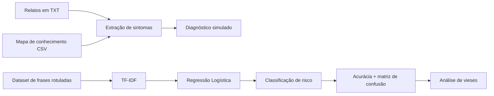
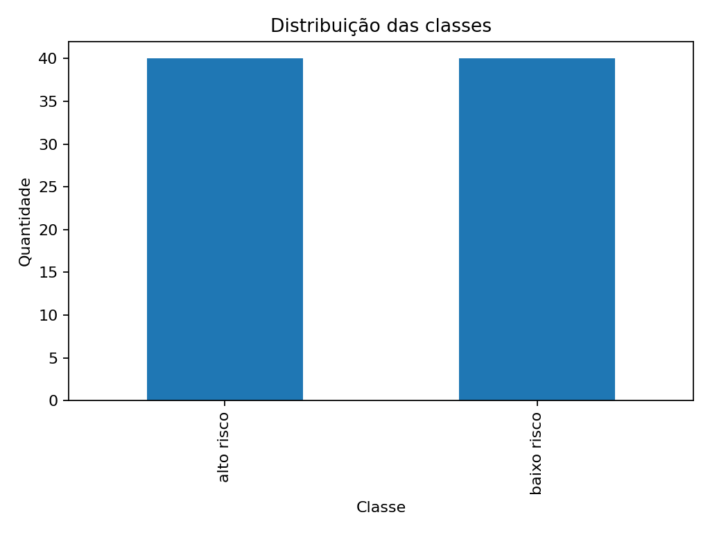
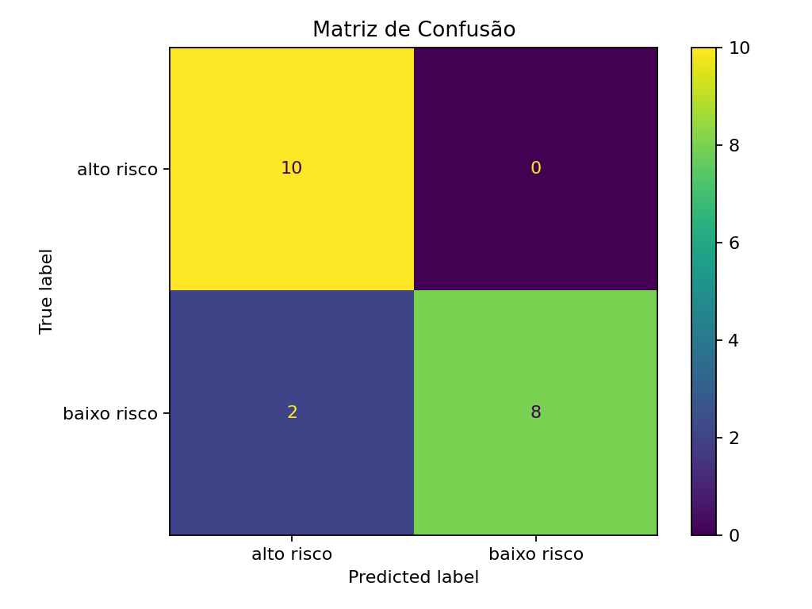

# CardioIA — Fase 2: Diagnóstico Automatizado

Projeto acadêmico desenvolvido para a **Fase 2 do CardioIA**, com foco em NLP, extração de sintomas, classificação de risco com Machine Learning e reflexão sobre vieses.

> ⚠️ **Aviso importante:** este projeto é exclusivamente educacional e utiliza dados simulados. Não é um dispositivo médico, não fornece diagnóstico clínico real e não substitui avaliação de profissionais de saúde.

## Integrantes

- Gustavo Trindade Soares — RM567848
- Guilherme Filartiga — RM568034
- João Pedro Nishikawa Alves — RM562376

## Objetivo

Construir um protótipo capaz de:

1. Ler relatos de sintomas em linguagem natural;
2. identificar expressões relevantes;
3. relacionar os sintomas a um mapa de conhecimento;
4. sugerir um diagnóstico **simulado**;
5. classificar frases em `alto risco` ou `baixo risco`;
6. avaliar o classificador e discutir limitações, vieses e governança.

## Arquitetura da solução



## Estrutura do repositório

```text
CardioIA_Fase2/
├── frases_sintomas.txt
├── mapa_conhecimento.csv
├── parte1_extracao.py
├── resultados_parte1.csv
├── dataset_risco.csv
├── parte2_classificador.ipynb
├── demo_completo.py
├── requirements.txt
├── distribuicao_classes.png
└── matriz_confusao.png
```

## Parte 1 — Extração de sintomas

O arquivo `frases_sintomas.txt` contém 10 relatos completos e variados.

O arquivo `mapa_conhecimento.csv` funciona como uma ontologia simplificada, associando duas expressões de sintomas a uma doença.

O script `parte1_extracao.py`:

- normaliza o texto;
- remove diferenças de acentuação para comparação;
- procura expressões presentes no mapa;
- contabiliza correspondências por doença;
- sugere o diagnóstico com maior número de evidências;
- grava o resultado em `resultados_parte1.csv`.

### Executar

```bash
python parte1_extracao.py
```

## Parte 2 — Classificador de risco

O arquivo `dataset_risco.csv` contém **80 frases simuladas**, balanceadas entre:

- 40 exemplos de `alto risco`;
- 40 exemplos de `baixo risco`.

No notebook `parte2_classificador.ipynb`, o texto é transformado com **TF-IDF** e classificado com **Regressão Logística**.

A execução de referência utiliza:

- `train_test_split` estratificado;
- `TfidfVectorizer` com unigramas e bigramas;
- `LogisticRegression`;
- acurácia;
- precision, recall e F1-score;
- matriz de confusão;
- validação cruzada com 5 folds.

Na execução preparada neste repositório, o holdout obteve **90% de acurácia**. Como o conjunto é pequeno e sintético, esse número não deve ser interpretado como validação clínica.

## Resultados visuais

### Distribuição das classes



### Matriz de confusão



## Análise de vieses e governança

O projeto inclui uma discussão explícita sobre:

- balanceamento de classes;
- viés de representação;
- viés de vocabulário;
- limitação de generalização;
- ausência de atributos demográficos para avaliação de fairness por subgrupos;
- necessidade de validação clínica, privacidade e supervisão humana.

A opção por dados simulados também evita exposição de dados pessoais reais de pacientes.

## Instalação

Recomendado: Python 3.10+.

```bash
pip install -r requirements.txt
```

Para abrir o notebook:

```bash
jupyter notebook parte2_classificador.ipynb
```

## Demonstração rápida

Para mostrar as duas partes no vídeo:

```bash
python demo_completo.py
```

Depois, abra o notebook e mostre a matriz de confusão e a seção de análise de vieses.

## Vídeo

Vídeo de demonstração (YouTube — não listado):

**[COLE_AQUI_O_LINK_DO_YOUTUBE]**

## Correspondência com a rubrica

| Critério | Evidência no projeto |
|---|---|
| Relatos e mapa de conhecimento organizados | `frases_sintomas.txt` + `mapa_conhecimento.csv` |
| Código de extração funcional | `parte1_extracao.py` + `resultados_parte1.csv` |
| Dataset criado corretamente | `dataset_risco.csv` |
| Classificador treinado e testado | `parte2_classificador.ipynb` |
| README e repositório organizado | este `README.md` |
| Vídeo de demonstração | link acima |

## Tecnologias

- Python
- Pandas
- Scikit-learn
- TF-IDF
- Logistic Regression
- Matplotlib
- Jupyter Notebook

## Observação final

O CardioIA desta fase é um protótipo didático para demonstrar como NLP e Machine Learning podem apoiar uma lógica de triagem. Qualquer aplicação clínica real exigiria dados validados, revisão ética, testes externos, monitoramento de vieses e participação de profissionais de saúde.
